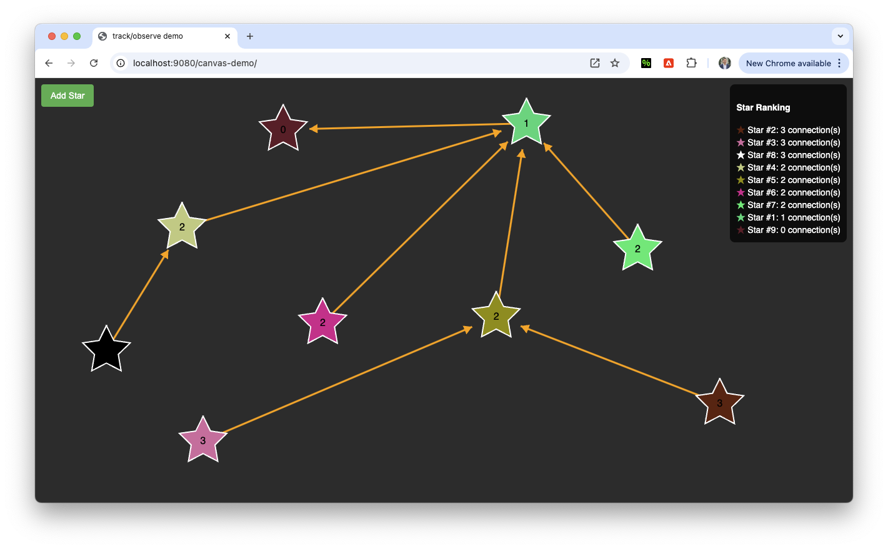

# Pico State Manager 🎷

## Demos

Shopping cart demo: (https://yesil.github.io/picosm/examples/cart/index.html)
<br>

Canvas demo: (https://yesil.github.io/picosm/examples/stars/index.html)
<br>

In this demo, the ranking of stars with the most connection is updated using a debounced observer, and tracking connected stars.
Use the metakey to connect stars to each other.



## Introduction

Pico State Manager is an experimental, lightweight, zero-dependency state manager that replicates core MobX features without using Proxy objects.

It also provides a helper function to make Lit components observers and updates them on changes.

Currently, the non-minified bundle size is `6747 bytes` and around `1794 bytes` gzipped.

You can also import only the specific modules you need from the source to further reduce the size.

## Features

- `makeObservable`: Instruments a class with observable capabilities.
- `observe`: Callback when the instance of an observable class changes.
- `reaction`: React to specific changes.
- `track`: Tracks other observables and notifies own observers on change.
- `subscribe`: Subscribe to arbitrary messages sent over an observable.
- `notify`: Notify all subscribers of an observable with arbitrary messages.
- `makeLitObserver`: Helper function to make Lit components observers and update them on changes.

## How to Use

Add the picosm dependency:

```bash
npm add https://github.com/yesil/picosm/releases/download/v1.1.0/picosm-1.1.0.tgz
```

See the unit test: https://github.com/yesil/picosm/blob/main/test/LitObserver.test.js <br>
See the demo app source code: https://github.com/yesil/picosm/tree/main/examples for a more comprehensive example.

## API Documentation

### `makeObservable`

Makes a class observable by adding reactive capabilities. The class should define:

- `static observableActions`: Array of method names that should notify observers when called
- `static computedProperties`: Array of getter names that should be cached until invalidated by an observable action

#### Example

```javascript
import { makeObservable } from 'picosm';

class Counter {
  static observableActions = ['increment', 'incrementOther'];
  static computedProperties = ['total'];

  value = 0;
  otherValue = 0;

  increment() {
    this.value += 1;
  }

  incrementOther() {
    this.otherValue += 1;
  }

  get total() {
    return this.value + this.otherValue;
  }
}

makeObservable(Counter);
const instance = new Counter();
instance.increment();
console.log(instance.value); // 1
```

### `observe`

Creates an observer for a given observable.

Returns a `disposer` function.

#### Example

```javascript
import { observe } from 'picosm';

const disposer = observe(instance, () => {
  console.log('Instance changed');
});
instance.increment(); // Logs: 'Instance changed'
disposer(); // Stops observing
```

### `reaction`

React to specific changes.

Returns a `disposer` function.

#### Example

```javascript
import { reaction } from 'picosm';

const disposer = reaction(
  instance,
  ({ value }) => [value],
  (value) => {
    console.log('Value changed to', value);
  },
);
instance.increment(); // Logs: 'Value changed to 1'
instance.incrementOther(); // nothing happens
disposer(); // Stops reacting
```

### `track`

Tracks other observables and notifies own observers on change.

Returns a `disposer` function.

#### Example

```javascript
import { track, observe } from 'picosm';

const otherInstance = new Counter();
const disposer = track(instance, otherInstance); // notify instance when otherInstance changes

const disposer = observe(instance, () => {
  console.log('tracked dependency has changed', otherInstance);
});
otherInstance.increment();
disposer();
```

### `subscribe & notify`

#### subscribe

Subscribe to arbitrary messages sent over an observable.

Returns a `disposer` function.

#### notify

Notify all subscribers of an observable with arbitrary messages.

#### Example

```javascript
import { subscribe, notify } from 'picosm';

const disposer = subscribe(instance, (message) => {
  console.log('Message received', message);
});
notify(instance, 'hello world');
disposer(); // Stops subscribing
```

## Contributing

Please feel free to:

- Open a PR to contribute.
- Create an issue to request a feature.
